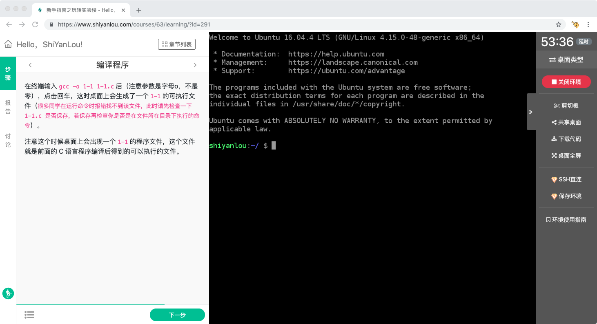
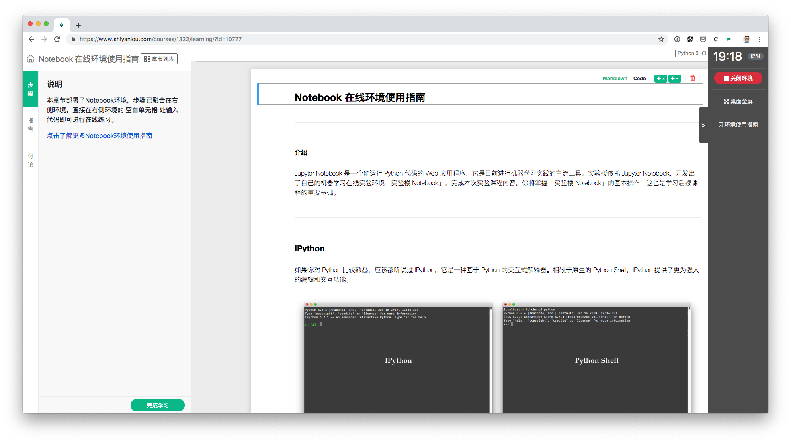
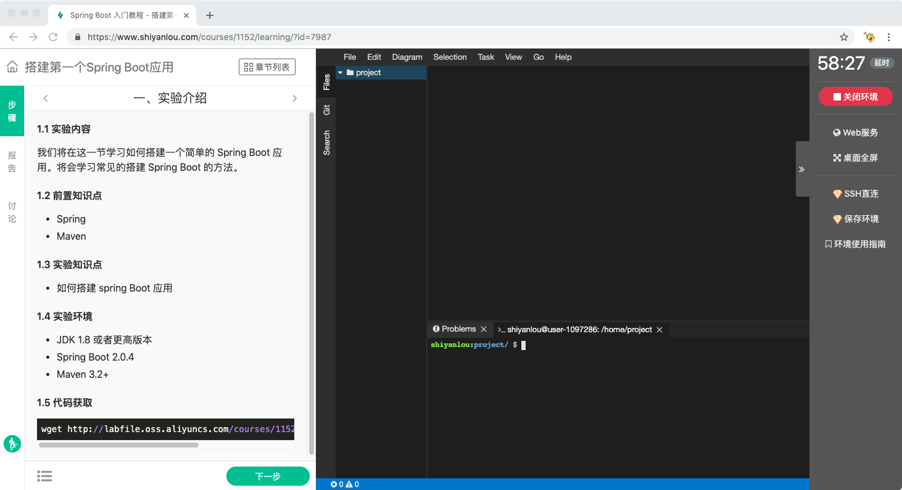

# 界面介绍

## 介绍

实验楼中不同的实验会采用不同的实验环境，为了让实验的体验达到最优，不同的实验环境又可以呈现出不同的学习界面。

## 实验环境

实验环境指的是实验启动的在线操作环境，目前会用到容器和虚拟机环境两种。

容器实验启动速度很快，一般几秒钟就可以看到桌面，部分容器无法支持的实验，会用到虚拟机。虚拟机实验启动较慢（3分钟左右），并且不能保存和 SSH 直连。

## 实验界面

实验界面指的是我们在启动实验环境后面对的操作界面，目前实验楼的实验中支持图形界面（桌面模式），字符界面，Jupyter Notebook 和 Web IDE 四种界面。这四种界面的适用场景：

* 图形界面：适用绝大部分实验，例如 Linux 基础入门实验
* 字符界面：适用于 Linux 操作系统相关的实验，不需要桌面软件的实验类型，例如 Vim 实验
* Jupyter Notebook：适用于数据分析、机器学习等实验
* Web IDE：适用于 Java、PHP 及 Web 前端实验

## 功能支持

无论是容器还是虚拟机，都有能力支持四种学习界面，大家在实验过程中看到的只是学习界面，但由于后台的实验环境不同，会发现同一种界面下的功能也会有不同。可以通过以下表格查看功能支持情况。

四种界面的功能支持：

|功能|图形界面|字符界面|Jupyter Notebook|Web IDE|
|---|---|---|---|---|
|实验步骤|支持|支持|注1|支持|
|实验报告|支持|支持|支持|支持|
|切换界面|支持|支持|||
|倒计时与延时|支持|支持|支持|支持|
|有效学习时间|支持|支持|支持|支持|
|剪切板|支持|支持|注2|注2|
|共享桌面|支持||||
|下载代码|支持|支持|支持|支持|
|SSH直连（会员）|支持|支持||支持|
|保存环境（会员）|支持|支持||支持|

* 注1：Jupyter Notebook 的实验步骤已经混合到实验环境中的 Notebook 文档里，因此无法支持通常意义的步骤和自动步骤验证。
* 注2：由于 Jupyter Notebook 和 Web IDE 可以直接拷贝粘贴，所以不需要单独实现剪切板功能。

