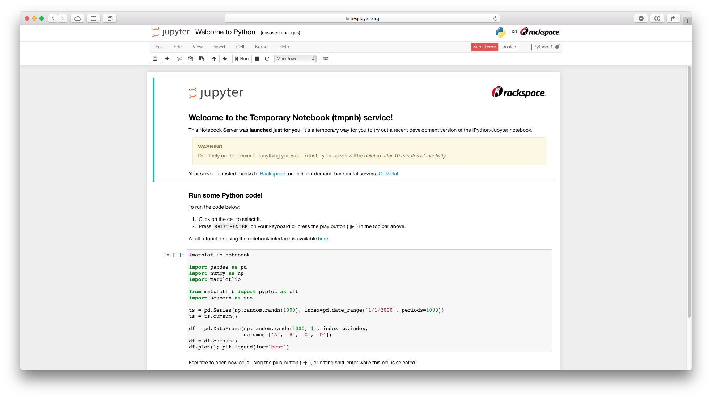
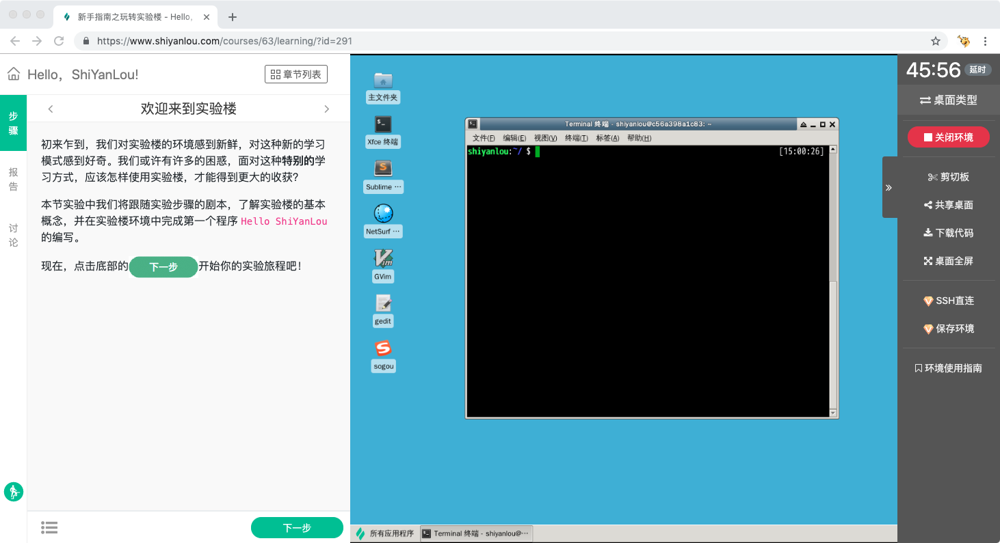
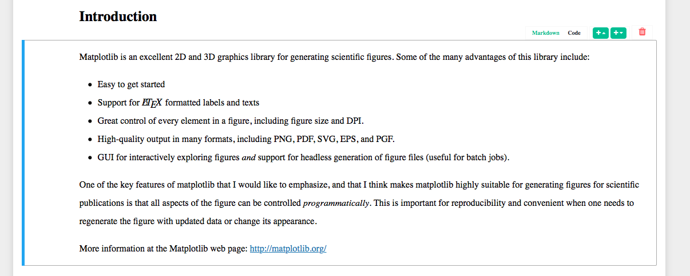

# Jupyter Notebook

## 介绍

目前，实验楼已经上线了数十门机器学习和数据分析相关的课程，内容覆盖了 Pandas，Matplotlib，Scikit-learn 等常用的第三方模块的使用，以及神经网络、支持向量机、随机森林等算法的实战。

如今，为了让大家更加方便和高效地学习这些课程。实验楼上线了全新的机器学习和数据分析在线实验环境（以下简称：新环境），新环境是为数据分析及机器学习量身定制，和实验楼现有的桌面式在线环境截然不同。

### Jupyter Notebook 的来源

熟悉机器学习和数据分析的朋友们可能都听说过 IPython，它是一种基于 Python 的交互式解释器。相较于原生的 Python Shell，IPython 提供了更为强大的编辑和交互功能。

IPython 之后，就出现了 IPython Notebook，它完整地继承了 IPython 的交互式特性，同时以 Web 形式运行。IPython Notebook 的出现，让数据分析和机器学习的过程变得高效。

再之后，在谷歌、微软等互联网巨头的赞助下，IPython Notebook 发展成为更加成熟和完善的开源项目，并更名为 Jupyter Notebook。相信有很多朋友对这个名字和下面的界面并不陌生。

如今，实验楼基于 Jupyter Notebook 为机器学习和数据分析提供在线实验环境，界面如下所示。

## 使用

如果你先前使用过 Jupyter Notebook，我们相信当你接触到实验楼的 Jupyter Notebook 的界面会很容易上手。下面详细介绍界面的正确使用姿势。

### 与图形界面的区别

目前，图形界面如下图所示，大致分为两部分：左边是实验步骤，右边是在线实验环境。学习时，你通过阅读文档内容，并自己动手在右侧的在线环境中练习。

而在 Jupyter Notebook 界面中，学习逻辑就会发生一些变化。如今，实验步骤和实验环境被融为一体，你只需要跟随实验楼制作好的每一个实验内容，从头到尾一步一步完成练习即可。下面，我们就了解一下 Jupyter Notebook 中的实验内容的组成结构。

### 单元格

内容结构中最基本的组成单位被称之为单元格，一节完整的实验由若干个单元格按顺序构成。如下图所示，当你使用鼠标在课程界面单击时，就会选中相应的单元格，被处于选中状态的单元格的左侧会出现一条蓝色的竖线（区别于编辑状态时的绿色竖线）。

每一个单元格会有两种模式，分别是 Markdown（文本） 和 Code（代码）。在实验楼的课程中，教学内容都是以 Markdown 单元格展示，而你需要动手练习的代码将在 Code 单元格中执行。

### 单元格的两种模式

如何判断一个单元格是 Markdown 单元格，还是 Code 单元格？一般有两种方式。首先，选中之后的单元格右上角会出现一个菜单栏，绿色高亮的按钮就代表当前单元格的模式。上图中，就是一个典型的 Markdown 单元格。

除此之外，更简单的方法就是观察单元格的背景色。如下图所示，我们将 Code 单元格的背景色设置成为黑色，而 Markdown 单元格的背景则为白色。

### 单元格菜单栏

上面提到了单元格右上角的菜单栏。如下图所示，这个菜单栏中包含了针对单元格常见的 4 种操作。

### 运行代码

你可能会有疑问，那就是自己在哪里书写练习代码并执行呢？当前，这一切都是在 Code 单元格中完成。如下图所示，当你在 Code 单元格中书写 `print('hello, world!')` 时，点击左侧的运行按钮 ▶，相应的代码就会立即执行，并在单元格的下方显示输出内容。

### 保存自己的代码

首先，在 Jupyter Notebook 界面中输入的字符和代码都是自动保存的，无需担心刷新页面后造成自己动手练习代码出现丢失，只有当前关闭环境（点击右边工具栏的关闭环境按钮，或环境超时自动停止）的时候，才会被完全删除。

## 界面特点

### 单元格执行顺序

无论是 Markdown 单元格，还是 Code 单元格，它们在课程中都是按照从上到下的顺序依次执行的。后面的单元格需要等待前面的单元格执行完成后，才能继续执行。执行完成的单元格左侧会出现 `In [序号]` 的标志，例如：

### 单元格的执行状态

对于复杂度高的代码，往往会意味着更加长时间的执行等待时间。在新环境中，当一个单元格处于执行状态时，单元格前面会出现 `In [*]` 符号，只有执行完成的单元格, `[]` 中的 `*` 才会变成相应的 `序号`。

除此之外，你可以通过页面右上角的 Kernel 状态指示器判断内核占用情况。如果 Python 字符右边出现了实心圆圈 ◉，代表内核处于占有状态。而空心圆圈 ◯ 则代表内核处于空闲状态。当然，也可能出现链接断开的符号，那就代表着内核已经断开链接，你可能需要刷新页面或重启实验环境。当然，实验楼会尽力让你避免遇到内核断开的状态。

### 上手体验

目前实验楼的机器学习和数据分析相关的课程都已经采用了 Jupyter Notebook 界面，如果需要体验，可以尝试以下课程：

1. [《K - 近邻算法实现手写数字识别系统》](https://www.shiyanlou.com/courses/777)
2. [《利用 Python 进行 NBA 比赛数据分析》](https://www.shiyanlou.com/courses/782)
3. [《Pandas 使用教程》](https://www.shiyanlou.com/courses/906)
4. [《NumPy 使用教程》](https://www.shiyanlou.com/courses/912)
5. [《基于 TensorFlow 实现卷积神经网络》](https://www.shiyanlou.com/courses/893)
6. [《Python 气象数据分析：Python 数据分析实战》](https://www.shiyanlou.com/courses/780)
7. [《Hopfield 算法基础讲解及实例实现》](https://www.shiyanlou.com/courses/989)
8. [《RNN 神经网络讲解及基础应用》](https://www.shiyanlou.com/courses/1022)
9. [《SIFT 特征提取分析算法讲解及应用》](https://www.shiyanlou.com/courses/1011)
10. [《利用 Tensorflow 设计简单的前向神经网络》](https://www.shiyanlou.com/courses/1029)
11. [《利用 TensorFlow 进行自然语言处理》](https://www.shiyanlou.com/courses/1026)

## 支持的功能

Jupyter Notebook 界面支持以下功能：

* [倒计时与延时](../feature/count_down.md)
* [有效学习时间](../feature/study_time.md)

Jupyter Notebook 的实验步骤已经混合到实验环境中的 Notebook 文档里，因此无法支持通常意义的步骤和自动步骤验证。